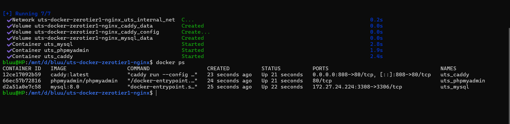
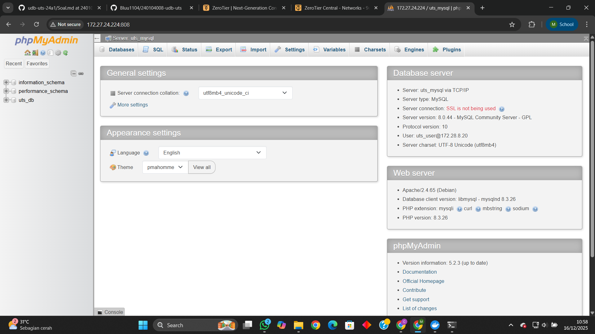
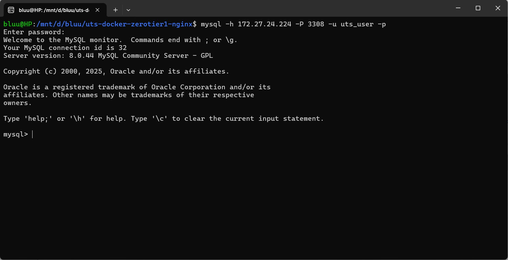

# UTS Docker, ZeroTier, dan Caddy

## Identitas Mahasiswa
Nama  : Muhammad Rasya Robi Ahnaf Sandjoyo
NIM   : 240104008  

---

## Konfigurasi Port
- **Port HTTP (Caddy)** : 808  
- **Port MySQL**        : 3308  

---

## Konfigurasi ZeroTier
- **IP ZeroTier Host** : 172.27.24.224  

ZeroTier dijalankan pada **HOST (Windows)** dan digunakan sebagai jaringan untuk akses MySQL dari luar container.

---

## Langkah Menjalankan Project

1. Clone repository:
   ```bash
   git clone https://github.com/Bluu1104/240104008-udb-uts.git```
   cd uts-docker-zerotier-nginx
2. Pastikan Docker dan ZeroTier sudah berjalan di host.
3. Jalankan Container dengan Commmand : docker-compose up -d
4. Pastikan seluruh service berjalan dengan command:docker ps

## Akses Service
- Akses phpMyAdmin (melalui Caddy)
1. Buka Browser dan Akses : http://172.27.24.224:808
2. Kemudian Login phpMyAdmin : 
	Server : uts_mysql

	Username : uts_user

	Password : uts_password

- Akses MySQL melalui ZeroTier
1. Gunakan command line (WSL atau CMD): mysql -h 172.27.24.224 -P 3308 -u uts_user -p
2. Masukkan password : uts_password

##ScreenShots






